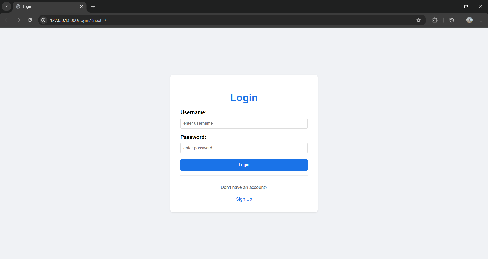
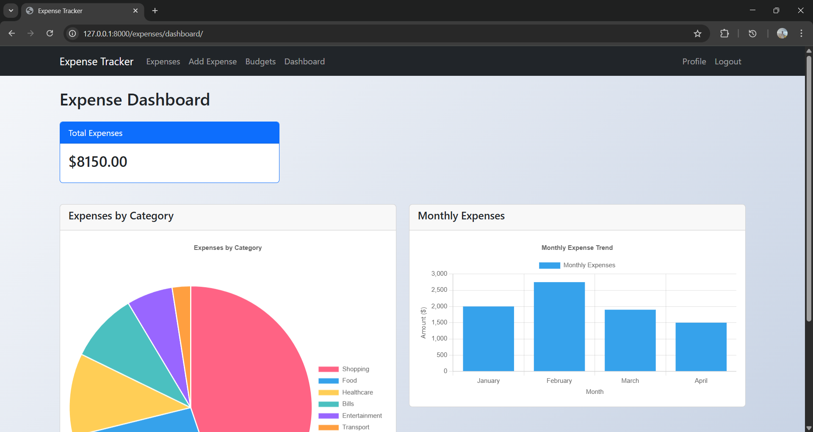
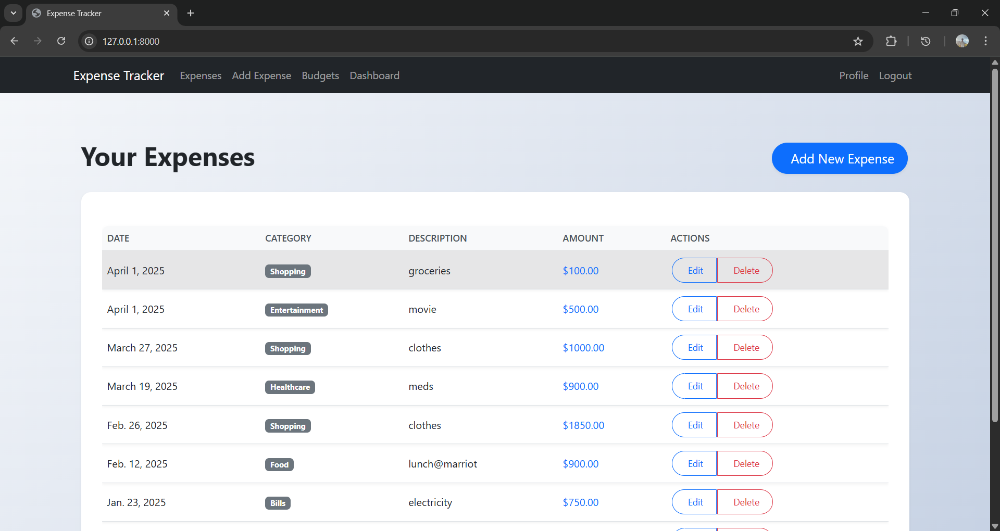
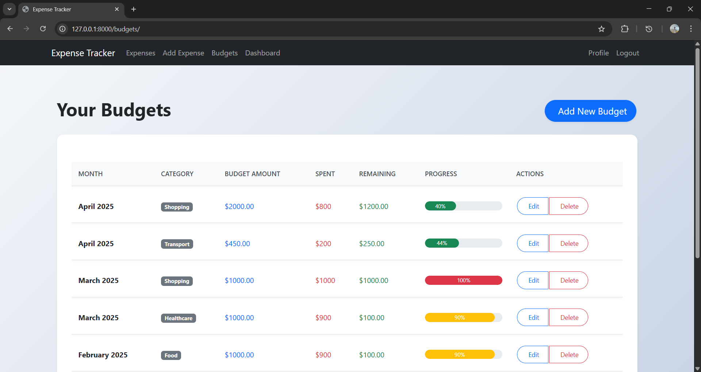

# Expense Tracker

## Overview
The **Expense Tracker** is a web application built using **Django** that helps users manage their expenses efficiently. It allows users to track their spending, set budgets, and visualize expenses using **Chart.js**.

## Features
- **User Authentication** (Registration, Login, Logout, Profile)
- **Expense Management** (Add, Update, Delete, View expenses)
- **Budget Tracking** (Set monthly budgets per category, track progress)
- **Dashboard with Visualizations** (Charts for expense categories & monthly trends using Chart.js)
- **Secure & Responsive UI** (Bootstrap & custom styling)

## Screenshots
### Login Page


### Dashboard


### Expense Management


### Budget Management


## Installation

### Prerequisites
Ensure you have the following installed:
- **Python 3.x**
- **Django**
- **Virtual Environment** (recommended)

### Steps
#### 1. Clone the repository:
```bash
git clone https://github.com/AbdulKareem-M/Expsense_Tracker.git
cd expense-tracker
```

#### 2. Create and activate a virtual environment:
**For macOS/Linux:**
```bash
python -m venv venv
source venv/bin/activate
```
**For Windows:**
```bash
python -m venv venv
venv\Scripts\activate
```

#### 3. Install dependencies:
```bash
pip install -r requirements.txt
```

#### 4. Apply database migrations:
```bash
python manage.py migrate
```

#### 5. Create a superuser (for admin access):
```bash
python manage.py createsuperuser
```

#### 6. Start the development server:
```bash
python manage.py runserver
```

#### 7. Access the app in your browser:
```
http://127.0.0.1:8000/
```

## Usage
- **Register/Login** to manage your expenses.
- **Add Expenses** under different categories.
- **Set Budgets** and track progress.
- **View Dashboard** with visual analytics.

## Technologies Used
- **Django** - Backend framework
- **SQLite / PostgreSQL** - Database
- **Bootstrap** - Frontend styling
- **Chart.js** - Data visualization
- **HTML, CSS, JavaScript**

## Future Enhancements
- **Income tracking**
- **Generate PDF & CSV reports**
- **Integrate AI-driven spending insights**

## License
This project is licensed under the **MIT License**.

Developed with ❤️ using Django.

